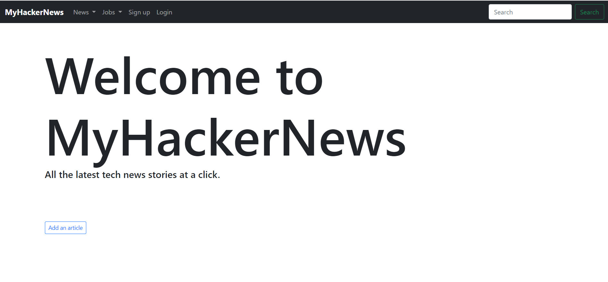
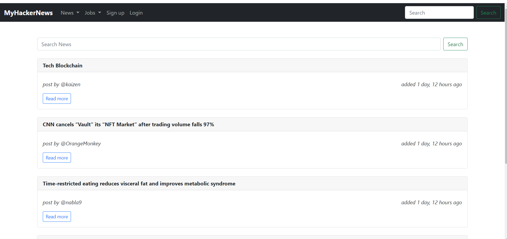
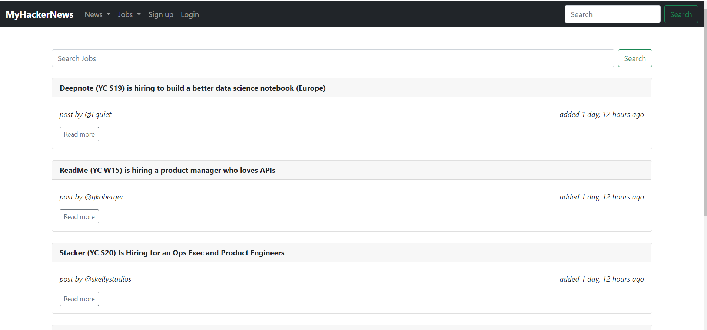

# MyHackerNews

## News Aggregation Web Application

MyHackerNews is a simple application that allows users to get up to date on tech-related news articles and tech job posts. Registered users can contibute by adding links to their blogs and online articles.


Within the project, the three apps worthy of note are:
1. News - Sourcing, display and addition of news articles  
2. Jobs - Sourcing, display and addition of jobs articles  
3. Accounts - Handles user authentication and authorisation

### Prerequisite
1. As this is a Django application you will need to have Python installed on your system. You can download and install Python from 
[https://www.python.org/downloads/]. This will allow you to be able to run 'python' commands.


## Getting Started
* Create a new directory where you would like this project stored. e.g NewsApp

* Change into that new directory

```
cd NewsApp
```

* Get a copy of the source code of this project into your local repository.

```
git clone https://github.com/KelvinJC/MyHackerNews.git
```

* The code will be packaged in a directory named MyHackerNews so change into that directory

```
cd MyHackerNews
```

<br><br>
* *In accordance with best practices, run this project within a virtual environment.*<br>
<br><br>

* Create a virtual environment. (Windows OS. Check out how to create and activate a virtual environment if you are on a different OS.)

```
python -m venv <name_of_environment> 
```

* Activate that environment

```
source venv/Scripts/activate 
```

* Install project dependencies

```
pip install django
pip install requests
```


### Database Creation

This project makes use of a sqlite database for storage of articles and job posts as well as user information. If you require a different database, customisation is possible via the settings.py file. <br>
For the sake of simplicity however, we will focus on using sqlite3. <br><br>


Change into the source code directory

```
cd src 
```

Run the following commands in succession

```
python manage.py makemigrations
python manage.py migrate
```


### Create a Django Admin User
This step is not critical to the usage of the app but if you are familiar with the Django Admin UI you can create a superuser i.e Admin

```
python manage.py createsuperuser 
```

Following the prompts you may enter your details for username, e-mail address (optional), password, password re-entry. <br><br>


### Run the server:

To begin using the application. Initiate the server by running the following command

``` 
python manage.py runserver 
```

By default, all Django applications listen on http://127.0.0.1:8000 so once the server is running, copy and paste the link into your preferred browser


### Screenshots

<br><br>



<br><br>





## User Tips
1. Sign in to be able to create news and job stories.
2. To search for news and job articles by poster, link or article title, use the search bar in the navbar area or on the respective pages.
